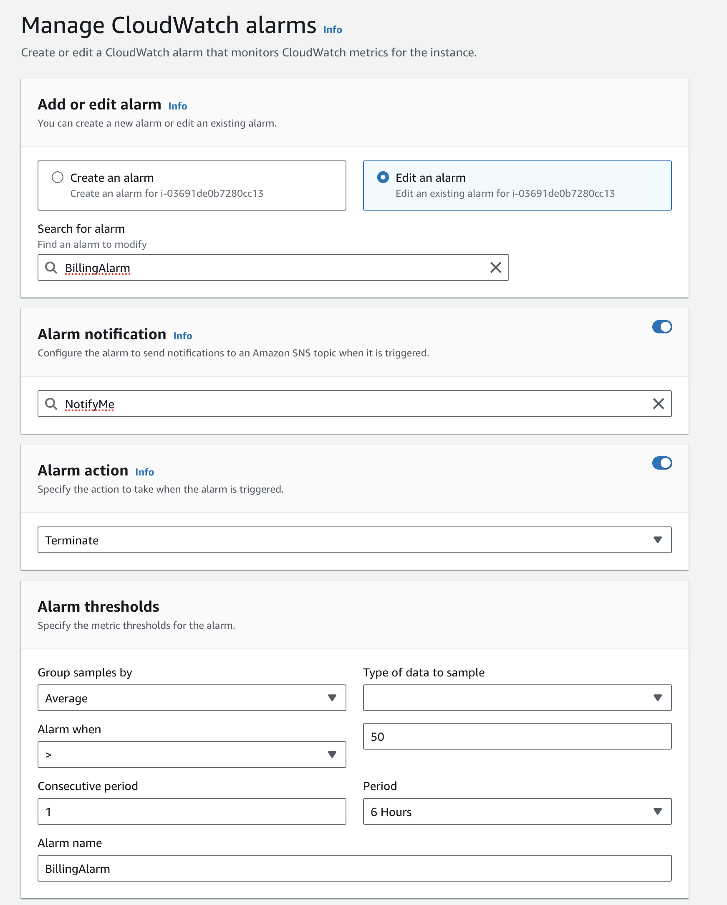

# Training data generation

Training data generation happens manually. The first step is generating a training data set against the original JSON
file using DuckDB by manually running `generate_training_data`. You'll need DuckDB. The data will download into `\data`

The second step, `model/generate_embeddings.py`, runs on an [AWS P3 instance.](https://aws.amazon.com/ec2/instance-types/p3/). [For a detailed explanation, check here](https://vickiboykis.com/2022/07/26/how-to-prepare-an-aws-test-image-for-pytorch/)

To provision one and train the data, you'll need an AWS account, keys, and the CLI set up.

1. Set up billing alarms for the instance first since they're expensive.


2. Get the DLAMI type you'll need to provision [with this script](https://gist.github.com/daveadams/8b67859c577f069b62fbea844c67d68a)
```bash
 aws ec2 describe-images \
    --region us-east-1 \
    --filters \
        Name=owner-id,Values=898082745236 \
        Name=name,Values="Deep Learning AMI (Ubuntu 18.04) *" \
    --query 'reverse(sort_by(Images, &CreationDate))[0].ImageId' \
    --output text
```

2. Spin up the instance, make sure the security group has the correct ports open
```bash
aws ec2 run-instances --image-id ami-0271ce88f6c03e149 --instance-type p3.2xlarge --key-name yourawskey  --security-group-ids yoursecuritygroup
```

3. Set up [Jupyter notebooks so you can run the training script interactively](https://docs.aws.amazon.com/dlami/latest/devguide/setup-jupyter.html)
```ssh -i your-key.pem -N -f -L 8888:localhost:8888 ubuntu@your-ip-address.compute-1.amazonaws.com```

4. Run `generate_embeddings.py` in the notebook. using the training data generated by `generate_training_data` as input (will need to move this to the instance.)

5. SCP the results to wherever you need them for the model, usually locally
``` scp -i yourkey ubuntu@yourinstance.compute-1.amazonaws.com:/home/ubuntu/ssl/20230701_learned_embeddings.snappy yourlocalmachine/20230701_learned_embeddings.snappy```
